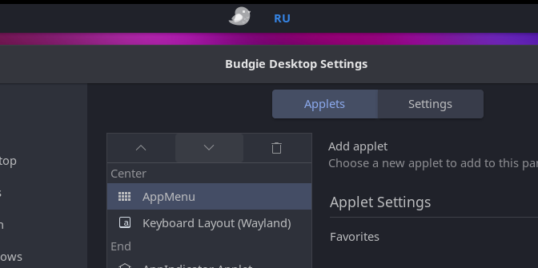

# Budgie Keyboard Layout Applet for Wayland (Labwc)

[English](#english) | [Русский](#русский)

---

<p align="center">
  
</p>

---

<a name="english"></a>
## English

Native keyboard layout switcher and indicator applet (**EN** / **RU**) for **Ubuntu Budgie (Wayland / Labwc session)**.

Specifically designed for **Ubuntu Budgie 26.04+ (and 24.04)**, where the Budgie desktop transitioned to `libpeas-2` and the Wayland session (`labwc`), leading to the removal of the legacy `budgie-keyboard-applet` and the deprecation of panel Python plugins.

---

### Features

- 🚀 **Native Plugin (`Loader=C`)**: Compiled as a shared library (`.so`) with `libpeas-2` and `budgie-3.0` support.
- ⚡ **Instant Response in Wayland**: Tracks layout changes via the Labwc compositor's `grp_led:scroll` hardware register (with fallback to `ibus`).
- 🖱️ **Mouse Click Support**: Switch layouts by clicking the applet on the panel (via `wtype` / `ibus`).
- 🎨 **Budgie-Themed Styling**: Clean indicator with accent color highlighting for active layout (e.g., accent blue for `RU`).
- 🛠️ **Automated Installation**: The installation script builds the library, configures `labwc/environment`, and adds the applet to the panel automatically.

---

### Requirements

- Ubuntu Budgie 24.04 / 26.04+ (Budgie Wayland / Labwc session)
- `budgie-panel` (10.9 / 10.10+)
- `wtype` (for mouse-click switch emulation)

---

### Installation

Clone the repository and run the installation script:

```bash
git clone https://github.com/AlexVDem/budgie-keyboard-layout-wayland.git
cd budgie-keyboard-layout-wayland
bash install.sh
```

The script will automatically:
1. Install required build dependencies (`valac`, `gcc`, `budgie-core-dev`, `libpeas-2-dev`, `libgtk-layer-shell-dev`, etc.).
2. Compile the plugin into `libkeyboard_layout_wayland.so`.
3. Install plugin files into the system directory (`/usr/lib/x86_64-linux-gnu/budgie-desktop/plugins/`) and the user's local directory.
4. Add the `grp_led:scroll` indicator option to `~/.config/budgie-desktop/labwc/environment`.
5. Add the applet to the panel and restart `budgie-panel`.

---

### Adding to Panel Manually

If the applet wasn't added automatically:
1. Open **Budgie Desktop Settings**.
2. Navigate to the **Panel** section.
3. Click the **"+" (Add applet)** button.
4. Select **"Keyboard Layout (Wayland)"** from the list and click "Add".

---

### Uninstallation

To remove the plugin:

```bash
bash uninstall.sh
```

---

### License

GPL-3.0 / MIT

---

<a name="русский"></a>
## Русский

Нативный апплет переключателя и индикатора раскладки клавиатуры (**EN** / **RU**) для **Ubuntu Budgie (сессия Wayland / Labwc)**.

Специально разработан для **Ubuntu Budgie 26.04+ (и 24.04)**, где рабочий стол Budgie переведён на `libpeas-2` и сессию Wayland (`labwc`), из-за чего старый `budgie-keyboard-applet` был убран, а Python-плагины больше не поддерживаются панелью.

---

### Особенности

- 🚀 **Нативный плагин (`Loader=C`)**: Скомпилирован в shared library (`.so`) с поддержкой `libpeas-2` и `budgie-3.0`.
- ⚡ **Мгновенный отклик в Wayland**: Отслеживание смены раскладки выполняется через аппаратный регистр `grp_led:scroll` композитора Labwc (с fallback на `ibus`).
- 🖱️ **Клик мышью**: Поддерживает смену языка кликом по апплету на панели (через `wtype` / `ibus`).
- 🎨 **Стилизация под тему Budgie**: Аккуратный индикатор с цветовым выделением активного языка (например, акцентный синий цвет для `RU`).
- 🛠️ **Автоматическая установка**: Скрипт сам собирает библиотеку, настраивает `labwc/environment` и добавляет апплет на панель.

---

### Требования

- Ubuntu Budgie 24.04 / 26.04+ (сессия Budgie Wayland / Labwc)
- `budgie-panel` (10.9 / 10.10+)
- `wtype` (для эмуляции переключения кликом мыши)

---

### Установка

Клонируйте репозиторий и запустите скрипт установки:

```bash
git clone https://github.com/AlexVDem/budgie-keyboard-layout-wayland.git
cd budgie-keyboard-layout-wayland
bash install.sh
```

Скрипт автоматически:
1. Установит необходимые зависимости для компиляции (`valac`, `gcc`, `budgie-core-dev`, `libpeas-2-dev`, `libgtk-layer-shell-dev` и др.).
2. Скомпилирует плагин в `libkeyboard_layout_wayland.so`.
3. Установит файлы плагина в системную директорию `/usr/lib/x86_64-linux-gnu/budgie-desktop/plugins/` и локальный каталог пользователя.
4. Пропишет опцию индикатора `grp_led:scroll` в `~/.config/budgie-desktop/labwc/environment`.
5. Добавит апплет на панель и перезапустит `budgie-panel`.

---

### Ручное добавление на панель

Если апплет не добавился автоматически:
1. Откройте **«Настройки рабочего стола Budgie»** (*Budgie Desktop Settings*).
2. Перейдите в раздел **«Панель»** (*Panel*).
3. Нажмите кнопку **«+» (Добавить апплет)**.
4. Выберите из списка **«Keyboard Layout (Wayland)»** и нажмите «Добавить».

---

### Удаление

Чтобы удалить плагин:

```bash
bash uninstall.sh
```

---

### Лицензия

GPL-3.0 / MIT
